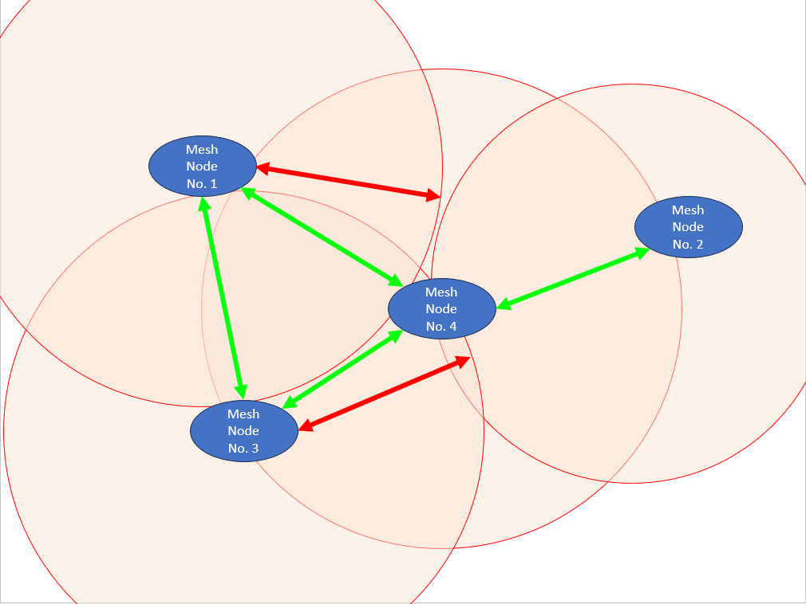
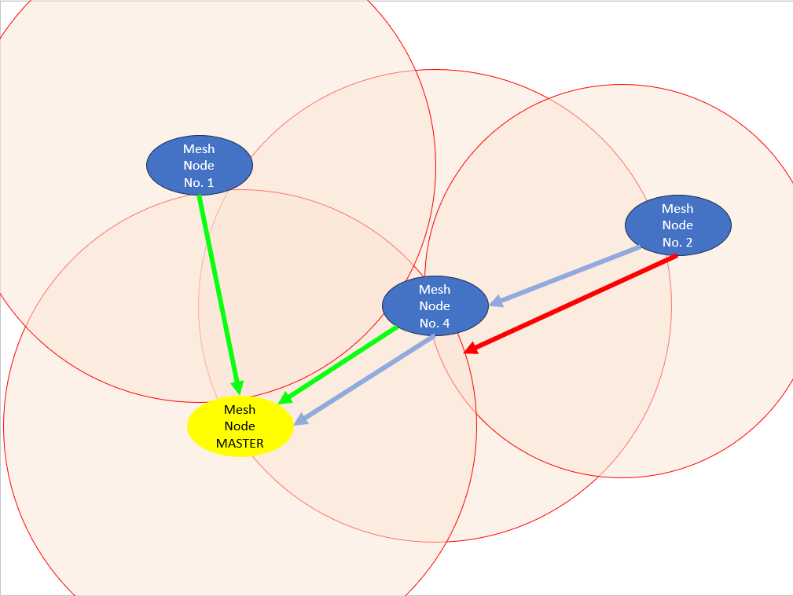

# LoRa Mesh Network using WisBlock API V2

## Application scenario
Do you need to deply sensor nodes in a wide area with big distances between the nodes and have all nodes to be able to send sensor data to the cloud? LoRa would be the right choice as it is a long range low power communication technology. 
LoRa is a long range low power communication technology. Using LoRa there are at least 3 possible scenarios:    
1. LoRaWAN, which has a defined protocol, encryption and requires a gateway and a LoRaWAN server to work    
2. LoRa P2P, which is used to communicate between two or more LoRa nodes. LoRa P2P does not have any protocol or encryption by default, this has to be implemented in the application itself.
3. LoRa Mesh, which enhances the P2P communication with the option to forward data packets to a receiver. Forwarding packets means that even if the receiver node is out of range of the transmitting node, other nodes that are connected to the same Mesh Network will forward the packet until it reaches the receiver node.

For the mentioned scenario where a large area needs to be covered, options (1) and (2) have some disadvanteges.    
Option (1) will require to make sure enough gateways are available to have all sensor nodes in the range of a gateway. This can be quite expensive and all of these gateway will need a separate connection to the cloud.
Option (2) might not be able to have connectivity of all nodes to each other which might not be feasable. And forwarding the sensor data to the cloud might not be easy to realize as well.        
Based on this, a LoRa mesh network might be the best solution. Connectivity to the cloud can be implemented in one of the nodes, read on to see a proposal how to do it.

----

## Solution
In this PoC, a LoRa mesh network is realized on top of the WisBlock API V2. Using the WisBlock API keeps all the communication functionality outside of the application code and setup of the device can be done through API calls or with the integrated AT commands.    
This PoC will show as well how to setup the mesh and have a dedicated node which has the connectivity to send the sensor data to the cloud.

----

## Possible LoRa Mesh configurations

### Any to any
One configuration option is that each mesh node can send packets to and receive packets from any other node:

During initialization of the mesh network, each node will build a mesh map. The mesh map of each node would look like:
| Node 1                              | Node 2                            | Node 3                            | Node 4        |
| ---                                 | ---                               | ---                               | ---           |
| node 1 - itself                     | node 2 itself                     | node 3 itself                     | node 4 itself | 
| node 3 - direct                     | node 4 direct                     | node 1 direct                     | node 1 direct | 
| node 4 - direct                     | node 1 forward over node 4, 1 hop | node 4 direct                     | node 2 direct | 
| node 2 - forward over node 4, 1 hop | node 3 forward over node 4, 1 hop | node 2 forward over node 4, 1 hop | node 3 direct | 

In this configuration, nodes 1,3 and 4 can directly communicate to each other, while node 2 is out of range of node 1 and 3.    
But due to the mesh map node 1 knows the existence of node 2, even it cannot see the packets coming from it. When it sends a packet to the address of node 2, the packet will be forwarded by node 4 which is in range of node 2. 

But in this configuration it would be difficult to send the sensor data to the cloud, as it is not clear, which of the nodes has to connection to the cloud.

----

### All to one

Another mesh configuration can declare one node as a master node and all other nodes are addressing their data packets to this master node:     
    
The mesh map of each node would still look the same as above. But the communication of nodes 1, 2 and 4 would be all addressed to the master node (former node 3).
In this configuration, nodes 1,3 and 4 can directly communicate to the master node, while node 2 would use node 4 to forward its data packets to the master node.    

This configuration is fitting best for the application scenario. The dedicated master node will be the one which has the connectivity to the cloud.

This example code can cover both scenarios. The master node address can be defined on each of the nodes with an AT command (or can be hard-coded in the application code, which is not recommended).    

----

## Initializing the mesh network

### Node adresses

To be able to build the mesh map, each node needs a unique ID or node address.     
Again there are at least two options to assign a node address:
- (1) hard-code a node address into the application code
- (2) use the unique identifier that most MCU's have as the node address

In the example code, the option (2) is used and the node adresses are created from the unique MCU ID's. Each nodes address is 4 bytes long. This means that each node can be flashed with exactly the same firmware.   
Using the option (1) can reduce the space that the address occupies in a data packet by limiting the address to a value between 1 and 255. But this means mean that each node has to be flashed with a specific firmware or that each node has to be assigned a node address manually through an AT command. 

_**The node address is obtained and assigned automatically during the setup process. The application does not need to handle it.**_

### Building the mesh map

After power up or reboot, each nodes start to send out its own mesh map, which at that time will only include its own node address. This map is in a different format than the data packets and is sent as a broadcast.    
Each node that receives the mesh map will compare it with its own mesh map and extend it with missing nodes from the received map. Then it sends out its updated new mesh map.    
After a short time all nodes in the map will have an updated mesh map with all nodes in it and the information if a specific node is in direct range or needs to be contacted through one or multiple other nodes.    

In the beginning the nodes send out the mesh map every 30 seconds, but after a while, the interval is reduced to save power.    

In addition, if a node receives a data packet with a node address that is not listed in its own mesh map, it will re-initiate a mesh initialization by sending out its own mesh map. This helps to accelerate an update of the mesh map in each node if a node joins after all other nodes have already finished their map initialization.

_**The initialization of the mesh map in each node is handled in the background. The application does not need to handle it by itself.**_

----

## How to use the example code

### Requirements

**General requirements**
- Each node has to be set to LoRa P2P mode
- Each node has to be set to the same LoRa P2P parameters

Both requirements can be set with AT commands through the USB connection of the WisBlock Base Boards.
If the P2P parameters are fixed for all scenarios where the devices will be used, they can be setup as well in the _**`setup_app`**_ call like this:    
```cpp
	// Read LoRaWAN settings from flash
	api_read_credentials();
	// Force LoRa P2P
	g_lorawan_settings.lorawan_enable = false;
	// Force frequency setting to 916.0 MHz
	g_lorawan_settings.p2p_frequency = 916000000;
	// Force bandwidth setting to 125 MHz
	g_lorawan_settings.p2p_bandwidth = 0; // 125 Mhz
	// Force spreading factor setting to SF7
	g_lorawan_settings.p2p_sf = 7;
	// Force coding rate setting to CR 4/5
	g_lorawan_settings.p2p_cr = 1;
	// Force preamble length setting to 8 symbols
	g_lorawan_settings.p2p_preamble_len = 8;
	// Force symbol timeout setting to 0 symbols
	g_lorawan_settings.p2p_symbol_timeout = 0;
	// Save LoRaWAN settings
	api_set_credentials();
```

**Additional functions in the application**    
The mesh network requires two callback functions in the application code:    
1. A function that will receive the data packet and can decode it
   - This function will receive the address of the sending node, a pointer to the data, the length of the data and the RSSI and SNR when the packet was received
   - In the example code this function is the _**`on_mesh_data`**_. It will decode the received data (a counter and 2 sensor data values) and print the values through the USB connection.
2. A function that is called when the mesh map has changed
   - This function might not be required for most applications. It can be used to check if nodes have disconnected from the mesh network or if new nodes have joined the mesh network. 
   - In the example this function is the _**`map_changed_cb`**_. It will wake the application handler and print out the changed map through the USB connection.

Beside of the two callbacks, the mesh handlers has to be called in the "standard" LoRa TX and RX functions inside _**`lora_data_handler`**_

```cpp
	// LoRa TX finished handling
	if ((g_task_event_type & LORA_TX_FIN) == LORA_TX_FIN)
	{
		g_task_event_type &= N_LORA_TX_FIN;

		// Call Mesh TX callback to check if further actions are required
		mesh_check_tx();
	}

	// LoRa data handling
	if ((g_task_event_type & LORA_DATA) == LORA_DATA)
	{
		g_task_event_type &= N_LORA_DATA;

		// Call Mesh RX callback to analyze the received package
		mesh_check_rx(g_rx_lora_data, g_rx_data_len, g_last_rssi, g_last_snr);
	}
```

_**Above code is a simplified version.**_

### Start the mesh network

To initialize the mesh network the pointers to the above mentioned callbacks have to submitted to the mesh init function.
```cpp
	g_mesh_events.data_avail_cb = on_mesh_data;
	g_mesh_events.map_changed_cb = map_changed_cb;

	// Initialize the LoRa Mesh
	// * events
	init_mesh(&g_mesh_events);
```

No other actions are required. The initialization of the LoRa transceiver will be handled in the background by the WisBlock API.
The initialization of the mesh map will be automatically started as well and handled by a separate FreeRTOS task that is started during the call of _**`init_mesh`**_.

### Sending data packets

To send data each node has two options:
1. Send the data to a specific node address
2. Send the data as a broadcast message to all other nodes

First a dummy sensor data packet is prepared. It consists of a counter and two additional data fields, each filled with the counter value as well. In a final application, this would be replaced with real sensor values.
```cpp
		// Create a dummy data packet with 3x 64bit counter value
		msg_cnt++;

		convert_value.l_value = msg_cnt;
		memcpy(&data_buffer[0], convert_value.b_values, 8);
		memcpy(&data_buffer[8], convert_value.b_values, 8);
		memcpy(&data_buffer[16], convert_value.b_values, 8);
```
In the application code this is handled depending on the existence of a master node.
1. If a master node address is defined (through an AT command, see below), the address of the master node will be used.
2. If no master node address is defined, the node will choose a random node address from the map.

```cpp
		// Select a random node from the map
		uint8_t selected_node_idx = 0;
		// Select broadcast as default
		bool use_broadcast = true;
		// Target node address;
		uint32_t node_addr = g_master_node_addr;

		if ((g_master_node_addr != 0) && (g_master_node_addr != 0xFFFFFFFF))
		{
			node_addr = g_master_node_addr;
			g_nodes_list_s route;
			// Check if we have a route to the master
			if (get_route(g_master_node_addr, &route))
			{
				MYLOG("APP", "Send to master node %08lX", g_master_node_addr);
				use_broadcast = false;
			}
			else
			{
				// No route, send as broadcast
				MYLOG("APP", "No route to master node %08lX", g_master_node_addr);
				use_broadcast = true;
			}
		}
		else
		{
			// Get the number of nodes in the map
			uint8_t node_index = nodes_in_map() + 1;
			MYLOG("APP", "%d nodes in the map", node_index);

			// Check how many nodes are in the map
			if (node_index > 2)
			{
				// Multiple nodes, select a random one
				selected_node_idx = (uint8_t)random(1, (long)node_index - 1);
				use_broadcast = false;
				MYLOG("APP", "Using node %d from the map", selected_node_idx);
			}
			else if (node_index == 2)
			{
				// Only 2 nodes in the map, send to the other one
				selected_node_idx = 1;
				use_broadcast = false;
				MYLOG("APP", "Using node 1 from the map");
			}
			else
			{
				// No other node, lets send a broadcast
				selected_node_idx = 0;
				use_broadcast = false;
				MYLOG("APP", "Empty map, using broadcast");
			}
			node_addr = get_node_addr(selected_node_idx);
			MYLOG("APP", "Got receiver address %08lX", node_addr);
		}
```

To send the data through the mesh, a simple call to _**`send_to_mesh`**_ is used. The function requires as parameters
- a flag if the message is a direct message or a broadcast message
- the address of the target node. This can be zero if the message is a broadcast message.
- a pointer to the data buffer
- the size of the buffer

```cpp
		// Enqueue the data package for sending
		uint8_t data_size = 24;
		if (!send_to_mesh(use_broadcast, node_addr, (uint8_t *)data_buffer, data_size))
		{
			MYLOG("APP", "Could not enqueue packet for sending");
		}
```

This is a non-blocking call. The data is saved in a message queue. The message queue is handled in the background and each message is sent one by one.    
By default the message queue can have four entries. This is sufficient for the example code, but if you have to send a lot of data, you might need to increase it more entries in the file _**mesh.cpp**_.    
Keep in mind that each entry requires a certain amount of memory and with a large queue you might get to the limit.
```cpp
/** Max number of messages in the queue */
#define SEND_QUEUE_SIZE 4
```

----

## Mesh specific AT commands

Beside of the standard WisBlock API AT commands, the example code adds three more AT commands that are specific to the Mesh Network.

### ATC+MASTER

Description: Set or get the current master node address

This command allows to read or set the mesh address of the master node. The master node address can be disabled by setting it to _**`FFFFFFFF`**_` 

| Command                    | Input Parameter | Return Value                                                  | Return Code              |
| -------------------------- | --------------- | ------------------------------------------------------------- | ------------------------ |
| ATC+MASTER?                    | -               | `ATC+MASTER: "Set/get Master Node address" | `OK`                     |
| ATC+MASTER=?                   | -               | `<Master Node Address>`                                                    | `OK`                     |
| ATC+MASTER=`<Input Parameter>` | `<Master Node Address>`      | -                                                             | `OK` or `+CME ERROR:6` |

**Examples**:

```
ATC+MASTER?
ATC+MASTER:"Set/get Master Node address"

ATC+MASTER=?
ATC+MASTER=CBE0E4F5
OK

ATC+MASTER=CBE0E4F5
OK

ATC+MASTER=CBE0E4
+CME ERROR:6
OK
```

### ATC+NODE

Description: Get the mesh address of the node

This command allows to read the mesh address of the node. It is a read only function.

| Command                    | Input Parameter | Return Value                                                  | Return Code              |
| -------------------------- | --------------- | ------------------------------------------------------------- | ------------------------ |
| ATC+NODE?                    | -               | `ATC+NODE: "Get this Node address" | `OK`                     |
| ATC+NODE=?                   | -               | `<Node Address>`                                                    | `OK`                     |

**Examples**:

```
ATC+NODE?
ATC+NODE:"Get this Node address"

ATC+NODE=?
ATC+NODE=6FA6BC6C
OK
```

### ATC+MESH

Description: Get the mesh map

This command allows to read the mesh map. It is a read only function.

| Command                    | Input Parameter | Return Value                                                  | Return Code              |
| -------------------------- | --------------- | ------------------------------------------------------------- | ------------------------ |
| ATC+MESH?                    | -               | `ATC+MESH: "Get the mesh map" | `OK`                     |
| ATC+MESH=?                   | -               | `<Mesh (multiline)>`                                                    | `OK`                     |

**Examples**:

```
ATC+MESH?
ATC+MESH:"Get the mesh map"


ATC+MESH=?
ATC+MESH=
#01: 6FA6BC6C ^^
#02: 2BD56908 <->
#03: CBE0E4F5 <->

OK
```

Explanation for the map    
_**`^^`**_ means this node, it is always the first address in the map    
_**`<->`**_ means the node is in range of this node    
_**`->nnnnnnnn #h: m`**_ means the node is not in direct range. It is bridged through the node with the address **`nnnnnnnn`** and is **`m`** hops away.